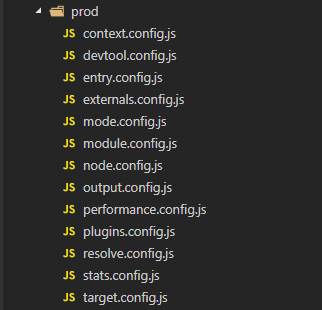

# webpack 工程实践（二）

- 为什么把所有项目都放在一个工程里面？

  1. 最大限度地复用资源
  2. 团队规约的最佳实践
  3. 方便对项目进行管理

> 在我们的工程背景下，我们需要制作各种各样的单页应用，而这些单页应用具有高度可复用性的特点，所以我们愿意把他们放在一个工程里管理，而不是各自为战。

- 怎么做到一个工程打包多个项目呢？

> 一直以来，打包多个项目就从来不是一件令人讨喜的事情。有人说，webpack 天生适合打包单页应用,打包多页就比较繁琐。事实上，打包多页无非就是多个入口的事。

- boss 提需求了

  1. 可以单独打包工程里某个单页应用
  2. 可以一起打包所有单页应用

> 我们的业务场景虽然挺变态的（需要配合 app 框架之类的），但是完成这两点需求还是非常容易的。

经过一番挣扎，思考如下：

1. 所有单页应用应该具备一致的入口，如 main.js
2. 所有单页应用的动态加载模块需遵循一定规律，才能在打包后放在各自的目录下

这是最为核心的两点，完成这两点，问题基本不会存在。

没有什么奇特的魔法，寻找入口是直接用遍历文件夹实现的：

```javascript
/**
 * @description 从插件文件夹下生成各个插件的入口
 */
pluginsArr.forEach(plugin => {
  if (plugin.indexOf('/src') >= 0) {
    const app = plugin.split('/')[0] + '/' + 'app';
    configEntry[app] = './plugins/' + plugin + '/main.js';
  }
});

module.exports = {
  entry: configEntry,
};
```

> 我们的单页应用，称之为插件。

这个时候，我们得到了所有插件的 entry。从这些 entry 出发，我们开始对它们进行处理。**事实上，打包多入口和单入口，区别就在这里，只需要修改入口文件就可以了，entry 是一个数组，单入口无非就是数组长度为 1 而已**。为了方便修改，我将所有 webpack 的配置项写成了单独的文件：



一些原来只适用于单入口打包的部分，稍作修改，就能完美切到多入口，还能兼容之前的单入口打包，这里列举最重要的两个部分（module 和 plugins）：

```javascript
// module.config.js
const modules = {
  module: {
    rules: [
      ...utils.styleLoaders({
        sourceMap: config.prod.productionSourceMap,
        extract: true,
        usePostCSS: true,
      }),
      {
        test: /\.js$/,
        loader: 'babel-loader',
        include: [
          utils.resolve('../plugins'),
          utils.resolve('../static/lib'),
          utils.resolve('../node_modules/webpack-dev-server/client'),
        ],
      },
    ],
  },
};

/**
 * @description webpack巨坑，无法获取entry，path还是源码目录，这尼玛
 */
pluginsArr.forEach(plugin => {
  if (plugin.indexOf('/src') >= 0) {
    const app = plugin.split('/')[0];
    modules.module.rules.push({
      test: new RegExp(app + '[\\s\\S]*\\.(png|jpe?g|gif|svg)(\\?.*)?$'),
      loader: 'url-loader',
      options: {
        limit: 10000,
        name: utils.assetsPath(
          app + '/assets/img/[name].[hash:7].[ext]',
          env.NODE_ENV,
        ),
      },
    });
    modules.module.rules.push({
      test: new RegExp(
        app + '[\\s\\S]*\\.(mp4|webm|ogg|mp3|wav|flac|aac)(\\?.*)?$',
      ),
      loader: 'url-loader',
      options: {
        limit: 10000,
        name: utils.assetsPath(
          app + '/assets/media/[name].[hash:7].[ext]',
          env.NODE_ENV,
        ),
      },
    });
  }
});

modules.module.rules.push({
  test: new RegExp('static[\\s\\S]*\\.(png|jpe?g|gif|svg)(\\?.*)?$'),
  loader: 'url-loader',
  options: {
    limit: 10000,
    name: utils.assetsPath(
      '../Public/images/[name].[hash:7].[ext]',
      env.NODE_ENV,
    ),
  },
});

modules.module.rules.push({
  test: new RegExp('static[\\s\\S]*\\.(woff2?|eot|ttf|otf)(\\?.*)?$'),
  loader: 'url-loader',
  options: {
    limit: 10000,
    name: utils.assetsPath('../font/[name].[hash:7].[ext]', env.NODE_ENV),
  },
});

module.exports = merge(baseModuleConfig, modules);
```

```javascript
// plugins.config.js
greePluginsArr.forEach(plugin => {
  if (plugin.indexOf('/src') >= 0) {
    const pluginRoot = plugin.split('/')[0];
    // extract webpack runtime and module manifest to its own file in order to
    // prevent vendor hash from being updated whenever app bundle is updated
    // const manifestPlugin = new webpack.optimize.CommonsChunkPlugin({
    //   name: 'manifest',
    //   filename: `Plugins/${pluginRoot}/manifest.[chunkhash].js`,
    //   minChunks: Infinity,
    // });
    // plugins.push(manifestPlugin);
    const htmlPlugin = new HtmlWebpackPlugin({
      filename: `Plugins/${pluginRoot}/index.html`,
      template: 'index.html',
      inject: true,
      minify: {
        removeComments: true,
        collapseWhitespace: true,
        removeAttributeQuotes: true,
        // more options: https://github.com/kangax/html-minifier#options-quick-reference
      },
      // necessary to consistently work with multiple chunks via CommonsChunkPlugin
      chunks: ['vendor', 'vuelib', 'manifest', pluginRoot + '/app'],
      chunksSortMode: 'dependency',
    });
    plugins.push(htmlPlugin);
    const copyPlugin = new CopyWebpackPlugin([
      {
        from: path.resolve(
          __dirname,
          '../../plugins/' + pluginRoot + '/config/config.xml',
        ),
        to: path.resolve(
          __dirname,
          '../../dist/Plugins/' + pluginRoot + '/config.xml',
        ),
        ignore: ['.*'],
      },
    ]);
    plugins.push(copyPlugin);
  }
});

module.exports = {
  plugins: plugins,
};
```

可以见到，无非就是遍历各个入口的插件进行处理罢了。这就是 iotfe 的玄机所在，没有任何黑魔法。
